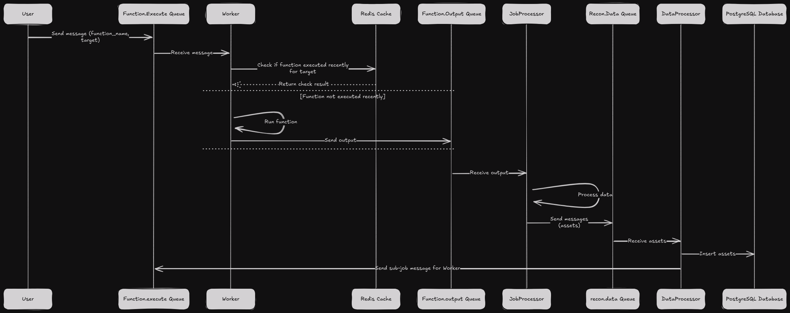

# H3XRecon

[](https://pypi.org/project/h3xrecon)
[](https://pypi.org/project/h3xrecon)

-----

<p align="center">
  
</p>

H3XRecon is a powerful bug bounty reconnaissance automation tool designed to streamline and automate the reconnaissance phase of security assessments. It provides a distributed architecture for efficient scanning and data processing.

## 🚀 Features

- Distributed reconnaissance architecture using Docker Swarm
- Real-time log aggregation and visualization with Grafana
- Modular plugin system for custom reconnaissance tools
- Centralized data processing and storage
- Built-in scope management and filtering
- Bug Bounty program management with scope management

## 📋 Prerequisites

- Docker Engine 20.10+
- Docker Compose v2 (`docker compose`, not `docker-compose`)
- Python 3.11+
- Ansible 2.9+ (for remote deployment)

## Recon Workflow

<p align="center">
  
</p>

## Credits

The client part of the project is inspired from the [BBRF client](https://github.com/honoki/bbrf-client) by @honoki. This is what I was using before I started this project, so I made it work in the same way,

## 💻 Getting Started (Docker Swarm)

Please refer to the [Docker Swarm README](docker_swarm/README.md) for more information on how to setup the project using Docker Swarm.

## 💻 Getting Started (Local Docker Compose)

### 1. Clone the repository:

```bash
git clone https://github.com/h3xitsec/h3xrecon.git
cd h3xrecon
```

### 2. Start the compose stack

```bash
docker compose up -d
docker compose logs -f
```

### 3. Install the h3xrecon client

Refer to the [CLI Documentation](docs/client.md) for more information on how to install the h3xrecon client.

### 4. Start using it !

Setup your first program

```bash
# Create a new program
h3xrecon program add program_name
# Add a scope to the program
h3xrecon -p program_name config add scope ".*example.com"
# Add a cidr to the program
h3xrecon -p program_name config add cidr "1.2.3.4/24"
# Send a job to the program
h3xrecon -p program_name sendjob resolve_domain example.com
# View data
h3xrecon -p program_name list domains/urls/ips/services
```

Alternatively, you can install the h3xrecon client as a python module and use it directly:

```bash
python -m venv venv
pip install git+https://github.com/h3xitsec/h3xrecon-cli.git
```

For more information on the commands, please refer to the [CLI Documentation](docs/cli.md).

### 5. Scaling the workers

Hot scaling the workers is as simple as running the following command:

```bash
compose scale worker=<number_of_workers>
```

Alternatively, you can set the number of workers in the .env.local file and restart the compose stack.

```bash
# Edit the .env.compose file to set the number of workers
H3XRECON_WORKERS_COUNT=<number_of_workers>
```

## 📊 Monitoring Dashboards

### Grafana
- **URL**: `http://<processor host>:3000`
- **Features**:
  - Real-time log aggregation
  - Service performance metrics
  - Custom reconnaissance dashboards

## 📖 Documentation

For detailed usage instructions and configuration options, please refer to the [CLI Documentation](docs/client.md).

## License

`h3xrecon` is distributed under the terms of the [MIT](https://spdx.org/licenses/MIT.html) license.
