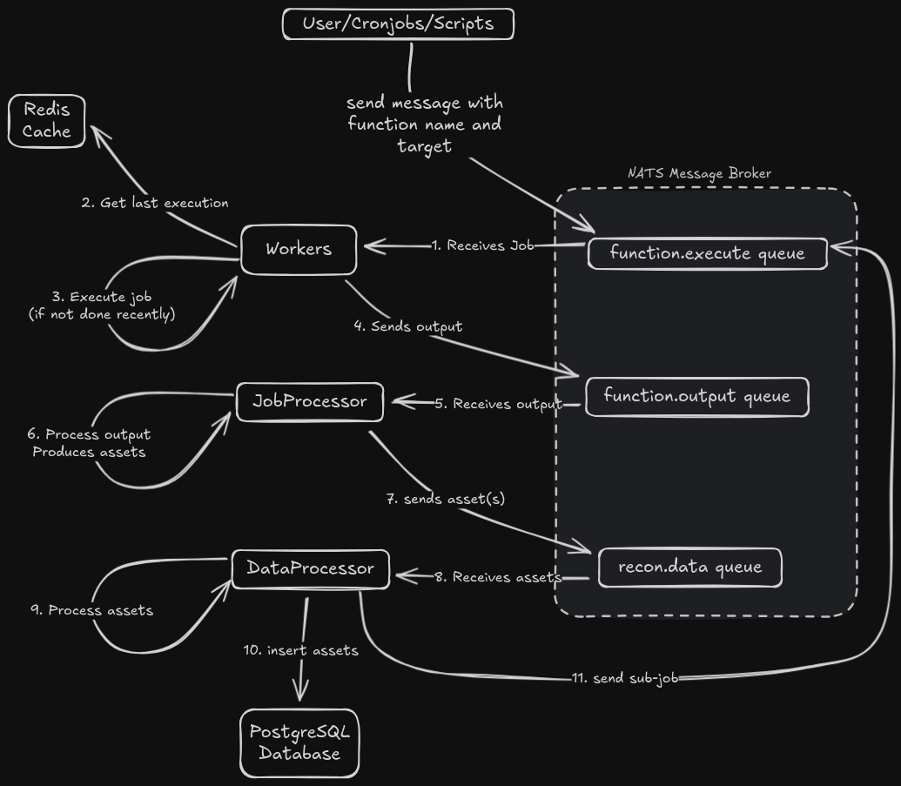

# h3xrecon

[](https://pypi.org/project/h3xrecon)
[](https://pypi.org/project/h3xrecon)

-----

# H3XRecon

<p align="center">
  
</p>

H3XRecon is a powerful bug bounty reconnaissance automation tool designed to streamline and automate the reconnaissance phase of security assessments. It provides a distributed architecture for efficient scanning and data processing.

## 🚀 Features

- Distributed reconnaissance architecture using Docker Swarm
- Real-time log aggregation and visualization with Grafana
- Modular plugin system for custom reconnaissance tools
- Centralized data processing and storage
- Built-in scope management and filtering
- Bug Bounty program management with scope management

## 📋 Prerequisites

- Docker Engine 20.10+
- Docker Compose v2 (`docker compose`, not `docker-compose`)
- Python 3.11+
- Ansible 2.9+ (for remote deployment)

## Recon Workflow

<p align="center">
  
</p>

## Credits

The client part of the project is inspired from the [BBRF client](https://github.com/honoki/bbrf-client) by @honoki. This is what I was using before I started this project, so I made it work in the same way,

## 💻 Getting Started

### Local Docker Compose Option

1. Clone the repository:
```bash
git clone https://github.com/h3xitsec/h3xrecon.git
cd h3xrecon
```

2. Start the compose stack
```bash
docker compose up -d
docker compose logs -f
```

3. Pull the cli docker image and setup the configuration file

```bash
# Pull the image
docker pull ghcr.io/h3xitsec/h3xrecon_cli:v0.0.3

# Create the configuration file
cat << EOF > ~/.h3xrecon/config.yaml
{
  "database": {
    "host": "localhost",
    "port": 5432,
    "database": "h3xrecon",
    "user": "h3xrecon",
    "password": "h3xrecon"
  },
  "nats": {
    "host": "localhost",
    "port": 4222
  },
  "logging": {
    "level": "DEBUG",
    "format": "<green>{time:YYYY-MM-DD HH:mm:ss}</green> | <level>{level: <8}</level> - <level>{message}</level>"
  }
}
EOF

# Create a shell alias for the h3xrecon command
alias h3xrecon="docker run --network=host --rm -it -v ~/.h3xrecon:/root/.h3xrecon ghcr.io/h3xitsec/h3xrecon_cli:v0.0.3"
```

4. Start using it

Setup your first program

```bash
# Create a new program
h3xrecon program add program_name
# Add a scope to the program
h3xrecon -p program_name config add scope ".*example.com"
# Add a cidr to the program
h3xrecon -p program_name config add cidr "1.2.3.4/24"
# Send a job to the program
h3xrecon -p program_name sendjob resolve_domain example.com
# View data
h3xrecon -p program_name list domains/urls/ips/services
```

Alternatively, you can install the h3xrecon client as a python module and use it directly:

```bash
python -m venv venv
pip install git+https://github.com/h3xitsec/h3xrecon-cli.git
```

For more information on the commands, please refer to the [CLI Documentation](docs/cli.md).

5. Scaling the workers

Hot scaling the workers is as simple as running the following command:

```bash
compose scale worker=<number_of_workers>
```

Alternatively, you can set the number of workers in the .env.local file and restart the compose stack.

```bash
# Edit the .env.compose file to set the number of workers
H3XRECON_WORKERS_COUNT=<number_of_workers>
```

### 🌐 Remote Deployment

⚠️ **WARNING**: The documentation for the remote deployment is currently incomplete and under active development. Details may change.

Ansible is used to deploy the H3XRecon stack to a remote Docker Swarm cluster.

It setup the whole docker swarm cluster using Tailscale as a communication layer between the nodes.

#### 1. Install Ansible requirements

```bash
# Install python-venv from your package manager
apt update && apt install python3-venv # Debian/Ubuntu

python -m venv venv
source venv/bin/activate
pip install -r requirements.txt
```

#### 2. Configure Ansible Inventory

Create your inventory file based on the example at `src/ansible/hosts.yaml.example` or the example below:

```yaml:hosts.yaml
all:
  vars:
    h3xrecon_base_directory: ./
    h3xrecon_target_directory: /home/{{ ansible_user }}/h3xrecon/
    h3xrecon_timezone: America/Montreal

  # No hosts defined by default
  hosts: {}
    

## Processor Host Group
## Those will be used to run the message broker, database, caching and processor services
processor:
  vars:
    H3XRECON_SWARM_ROLE: processor # This is used to set the node label in docker swarm
  hosts:
    processor1:
      ansible_host: 1.1.1.1
      ansible_user: username
      ansible_ssh_private_key_file: /path/to/private/key
      h3xrecon_dockercompose_pkg: docker-compose-plugin # Not all distros have the same package name so we set it here

## Workers Hosts Group
## Those will be used to run the worker services
workers:
  vars:
    H3XRECON_SWARM_ROLE: worker # This is used to set the node label in docker swarm
  hosts:
    worker1:
      ansible_host: 2.2.2.1
      ansible_user: username
      ansible_ssh_private_key_file: /path/to/private/key
      ansible_ssh_extra_args: '-o IdentitiesOnly=yes -o StrictHostKeyChecking=no'

    worker2:
      ansible_host: 2.2.2.2
      ansible_user: username
      ansible_ssh_private_key_file: /path/to/private/key
      ansible_ssh_extra_args: '-o IdentitiesOnly=yes -o StrictHostKeyChecking=no'

    worker3:
      ansible_host: 2.2.2.3
      ansible_user: username
      ansible_ssh_private_key_file: /path/to/private/key
      ansible_ssh_extra_args: '-o IdentitiesOnly=yes -o StrictHostKeyChecking=no'

    worker4:
      ansible_host: 2.2.2.4
      ansible_user: username
      ansible_ssh_private_key_file: /path/to/private/key
      ansible_ssh_extra_args: '-o IdentitiesOnly=yes -o StrictHostKeyChecking=no'
```

#### 3. Configure Nodes

Install prerequisites and set up Docker Swarm cluster:

```bash
# Will do the basic setup of the nodes and install docker and setup a docker swarm cluster
ansible-playbook ansible/setup_nodes.yaml
```

#### 4. Deploy Stack

Deploy the H3XRecon stack to the cluster:

```bash
ansible-playbook ansible/deploy_h3xrecon_stack.yaml
```

## 📊 Monitoring Dashboards

### Grafana
- **URL**: `http://<grafana-host>:3000`
- **Features**:
  - Real-time log aggregation
  - Service performance metrics
  - Custom reconnaissance dashboards

## 📖 Documentation

For detailed usage instructions and configuration options, please refer to the [CLI Documentation](src/h3xrecon/cli/README.md).

## License

`h3xrecon` is distributed under the terms of the [MIT](https://spdx.org/licenses/MIT.html) license.
