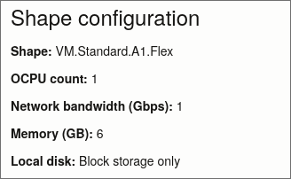

# 🌐 Remote Deployment to Docker Swarm

⚠️ **WARNING**: The documentation for the remote deployment is currently incomplete and under active development. Details may change.

Ansible is used to deploy the H3XRecon stack to a remote Docker Swarm cluster.

It setup the whole docker swarm cluster and deploys the stack

It has the option to use Tailscale as a communication layer between the nodes so there is no need to setup a VPN or forward ports.

## Suggested Infrastructure

- 1 Processor
- 4 Workers

You can run the processor node on any machine on your home network as those components won't do any reconnaissance on targets.

For the worker nodes, you can use the [Oracle Cloud Free Tier](https://www.oracle.com/cloud/free/) which includes 4 vCPUs and 24GB of RAM which you can split on 4 instances.

You can get 4 of those instance, each with a public IP address



## Setup

### 1. Install Ansible requirements

```bash
# Install python-venv from your package manager
apt update && apt install python3-venv # Debian/Ubuntu

python -m venv venv
source venv/bin/activate
pip install -r requirements.txt
```

### 2. Configure Ansible Inventory

Create your inventory file based on the example at `src/ansible/hosts.yaml.example` or the example below:

```yaml:hosts.yaml
all:
  vars:
    h3xrecon_base_directory: ./
    h3xrecon_target_directory: /home/{{ ansible_user }}/h3xrecon/
    h3xrecon_timezone: America/Montreal
    h3xrecon_swarm_mode: tailscale # This is used to set the swarm communicationmode to tailscale or lan

  # No hosts defined by default
  hosts: {}
    

## Processor Host Group
## Those will be used to run the message broker, database, caching and processor services
processor:
  vars:
    H3XRECON_SWARM_ROLE: processor # This is used to set the node label in docker swarm
  hosts:
    processor1:
      ansible_host: 1.1.1.1
      ansible_user: username
      ansible_ssh_private_key_file: /path/to/private/key
      h3xrecon_dockercompose_pkg: docker-compose-plugin # Not all distros have the same package name so we set it here

## Workers Hosts Group
## Those will be used to run the worker services
workers:
  vars:
    H3XRECON_SWARM_ROLE: worker # This is used to set the node label in docker swarm
  hosts:
    worker1:
      ansible_host: 2.2.2.1
      ansible_user: username
      ansible_ssh_private_key_file: /path/to/private/key
      ansible_ssh_extra_args: '-o IdentitiesOnly=yes -o StrictHostKeyChecking=no'

    worker2:
      ansible_host: 2.2.2.2
      ansible_user: username
      ansible_ssh_private_key_file: /path/to/private/key
      ansible_ssh_extra_args: '-o IdentitiesOnly=yes -o StrictHostKeyChecking=no'

    worker3:
      ansible_host: 2.2.2.3
      ansible_user: username
      ansible_ssh_private_key_file: /path/to/private/key
      ansible_ssh_extra_args: '-o IdentitiesOnly=yes -o StrictHostKeyChecking=no'

    worker4:
      ansible_host: 2.2.2.4
      ansible_user: username
      ansible_ssh_private_key_file: /path/to/private/key
      ansible_ssh_extra_args: '-o IdentitiesOnly=yes -o StrictHostKeyChecking=no'
```

### 3. Configure Tailscale

If you want to use Tailscale as a communication layer between the nodes, you need to set up a Tailscale account and create an Auth Key

First, copy the example vault file from `docker_swarm/ansible/vaults/tailscale_vault.yaml.example` to `docker_swarm/ansible/vaults/tailscale_vault.yaml`

Then you need to paste the Auth Key in the `docker_swarm/ansible/vaults/tailscale_vault.yaml` file.

Lastly, you need to encrypt the vault using the following command:

```bash
ansible-vault encrypt docker_swarm/ansible/vaults/tailscale_vault.yaml
```

Then paste the vault password in `docker_swarm/ansible/.vaultpass` file.

You also need to make sure the `h3xrecon_swarm_mode` variable is set to "tailscale" in the `hosts.yaml`'s `all` host group.

### 4. Configure Nodes

Install prerequisites and set up Docker Swarm cluster:

```bash
# This playbook will do the basic setup of the nodes
ansible-playbook ansible/setup_nodes.yaml

# This playbook will setup the docker swarm cluster
ansible-playbook ansible/setup_docker_swarm.yaml

# Validate the docker swarm cluster. This playbook will create a test service to make sure the cluster is working properly.
ansible-playbook ansible/validate_docker_swarm.yaml
```

### 5. Deploy Stack

Deploy the H3XRecon stack to the cluster:

```bash
ansible-playbook ansible/deploy_h3xrecon_stack.yaml
```

### 6. Adding worker nodes afterwards

Adding worker nodes to the cluster is as simple as adding them to the `workers` host group in the `hosts.yaml` file and run the playbooks from step 4 again.

